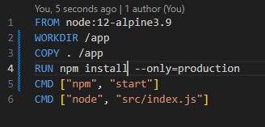
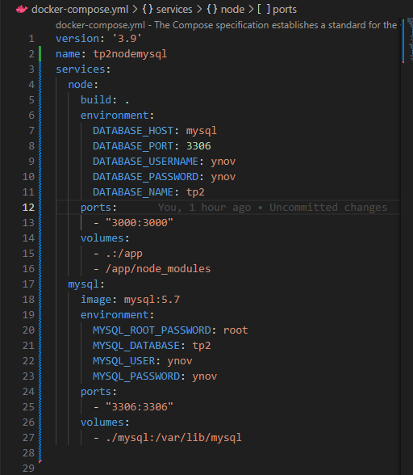
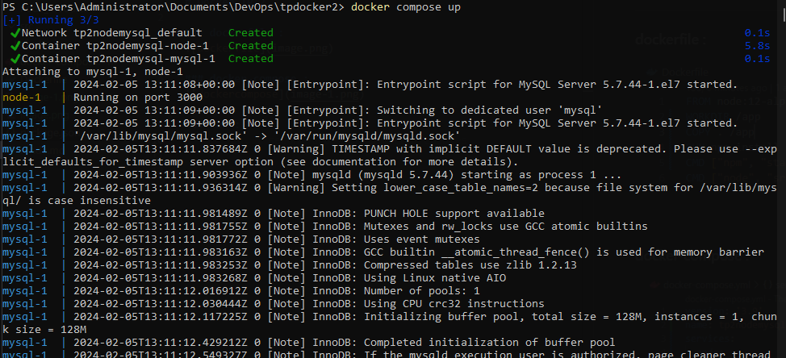
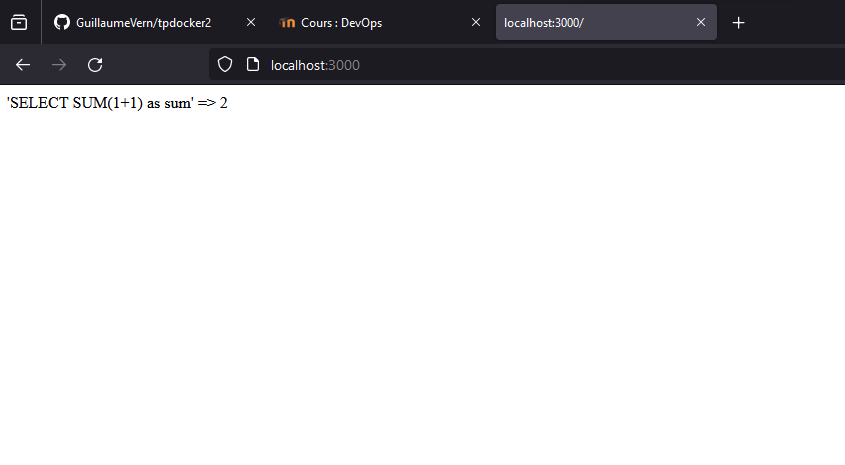

# Docker TP 2

### dockerfile :

### 2) a)
l'option de npm qui nous permet de n'installer que ce qui est nécessaire est l'option --only=production
elle permet d'installer uniquement les dépendences de production

### docker-compose :

### run :

### test :

